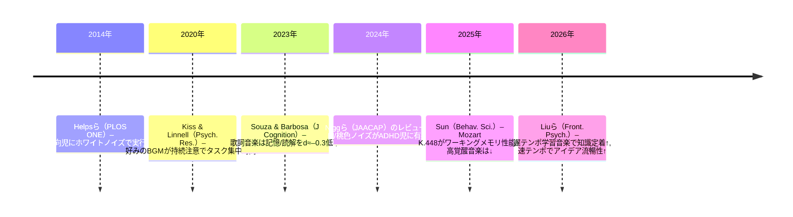
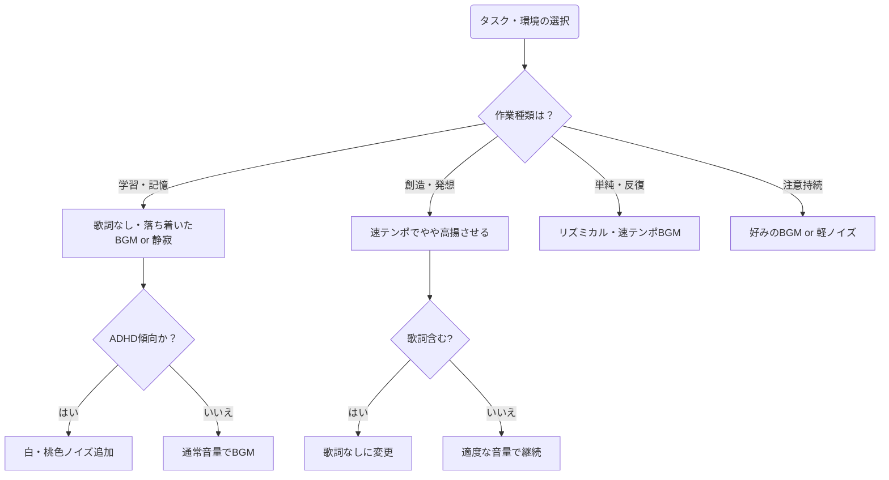

# エグゼクティブサマリ 
人が学習や作業時に聴く音楽・音刺激が集中力や生産性に与える影響は一貫せず、タスクの種類や個人差によって結果が異なる。実験的研究では、**歌詞を含む音楽は言語系作業を著しく阻害**する一方、**器楽曲や自然音は比較的中立的**であることが示されている。例えば、Souzaら（2023年）は「歌詞あり音楽」が言語・ビジュアル記憶や読解成績を約 *d*≈−0.3 で低下させた一方、インストゥルメンタル音楽には顕著な影響がなかった。一方、**ホワイトノイズ・ピンクノイズ**などのカラーノイズは、注意欠陥・多動性障害（ADHD）児・学生の認知性能を改善する一方、健常者にはやや成績を低下させる傾向がある。具体的には、Helpsら（2014年）ではADHD傾向の子供に対し中等度のホワイトノイズを付加すると実行機能テスト成績が向上し、注意力の高い子供では逆に悪化した。**リズム・テンポ**に関しては、速いテンポ音楽が覚醒レベルを上げ、単純作業の認知負荷を下げる効果が報告されており、逆に遅いテンポは処理速度や正答率を低下させる可能性がある。創造的思考では、児童実験で遅いテンポ音楽が学習内容の定着と発想の定着を促進し、速いテンポ音楽が発想の量（流暢性）を増やしたが新規性を減じたことが示されている。**定位（立体音・バイノーラル）**については、バイノーラルビート（左右で異なる周波数の音を聴く手法）に関する研究はまだ不一致が多く、一定の脳波共鳴効果は確認されていない。**音量・SNR**は、快適な聴取レベル（概ね60–70 dB以下）を保ち、過度な音量は聴覚へのリスクとなるほか集中を妨げる。さらに**個人差**として、ADHD傾向が強い人はノイズをプラスすることで作業効率が上がるが健常者では悪化しやすい。また、音楽的訓練歴のある人（演奏家など）はBGMの影響を受けにくく、むしろ音楽によって作業能率が高まる傾向が報告されている。以上より、音・BGMの効果は**状況依存的**であるとまとめられる。以下、主な研究成果を表１にまとめ、その後に**研究比較表**や**推奨事項**を示す。

# 音刺激の種類別効果 
- **ホワイト／ピンクノイズ**：注意力障害者には有益で、そうでない人には害も。HelpsらはADHD傾向の子供に中等度ホワイトノイズ（約76 dB）を与えると実行機能課題の成績が有意に改善する一方、注意力の高い子には成績悪化が見られたと報告。最新メタ分析でも、白色・ピンクノイズはADHDや高ADHD症状群における課題遂行を小幅ながら改善し、非ADHD群ではわずかに悪化させる傾向がある。一方、長時間・高音量のノイズは聴覚危害のリスクも指摘されている。  
- **バイノーラルビート**：左耳右耳で異なる周波数音を聴くと脳波同調が起こるとされるが、Ingendohらなどのレビューでは、研究間で結果がまちまちであり明確な結論には達していない。実験設定（キャリアトーン、ノイズの有無、音響開始時期など）によって結果が大きく異なるため、標準化された方法の確立が必要とされる。  
- **リズム・テンポ**：音楽の速さ（BPM）は覚醒レベルに影響する。一般に**速いテンポ**は覚醒を高め作業促進に働く可能性がある一方、**遅いテンポ**は処理速度を低下させうる。インドネシアの研究（Fernandesら2026年）では、中学生34名に数学課題を解かせた結果、120–190BPMの速いテンポ音楽下での正答率が最も高く、主観的認知負荷（NASA-TLX）は遅いテンポ（60–80 BPM）条件よりも有意に低かった。文献同士を比較すると、Linら（2023年）の別研究では遅いテンポ（60–80 BPM）が作業速度・正答率を約12%低下させたと報告されており、速いテンポの効果は限定的ながら仕事中の疲労軽減に役立つ可能性が示唆されている。さらに、創造的思考を扱った実験では、**学習時に遅いテンポ音楽**を流すと知識保持が向上し、**発想時に速いテンポ音楽**を流すとアイデアの量（流暢性）が増えたが独創性が下がったと報告されている。  
- **定位・立体音響**：バイノーラルビートと関連して、左右耳に異なる音を流すことで脳に錯覚的拍動（ビート）が生まれる。この手法はヘッドフォン使用が前提で、スピーカーでは効果は出にくい。研究では、バイノーラルビートに**ホワイトノイズ**を混ぜると注意力改善効果が得られやすい一方、ノイズなしでは効果が見られにくい傾向があるとされる。ただし、定位音響そのものが集中力に与える影響は明確でないため、実用面では周囲雑音の低減（ノイズキャンセリング等）や好みの広がりを考えたステレオ/バイノーラル選択が推奨される。  
- **音量・S/N比**：音量は適度に設定し、静かな環境を基本とする。大音量・大音圧比は刺激過剰となり注意散漫を招く恐れがある。特に長時間の高音量使用は聴力障害を招くので注意が必要である。背景音を付加する場合は、音源（ノイズや音楽）の信号対雑音比（S/N）が適切に管理された状態が望ましく、ヘッドフォン利用時は注意深く音量をコントロールする。  

# 音楽の特性と集中度  
- **歌詞の有無**：音楽に**歌詞（言語情報）**が含まれると、言語系課題や記憶課題に大きな悪影響を与える。Souzaら（2023年）は歌詞入り音楽が言語記憶・視覚記憶・読解力をd≈−0.3程度低下させるのに対し、インストゥルメンタル音楽（歌詞なし）では有意な影響は認められなかったと報告している。この傾向は他の研究でも一致しており、特に**言語情報が多いジャンル**（ポップやラップなど）のBGMはタスクパフォーマンスを妨げやすい。  
- **メロディー・ハーモニーの複雑さ**：音楽の複雑性も集中に影響する。複雑・予測不能な旋律や変化の激しい編曲は注意資源を奪いやすく、単純で予測可能な音楽（例えばアンビエントやバロック音楽の一定調子の曲）は目立った邪魔にならないことが多い。一部研究では、**落ち着いたリラックス調（α波音楽）**が学習効果を高めるとの報告もあるが、科学的な裏付けはまだ不十分である。  
- **音楽ジャンル・好み**：音楽のジャンルや聴き手の好みも影響する。一般に**クラシックやインストゥルメンタル**が学習用に好まれるが、これも個人差が大きい。Kiss & Linnell（2021年）は被験者が好むBGMを自選して持続注意課題（PVT）を行ったところ、**音楽聴取時は「タスク集中状態」の割合が有意に増加し、反応時間の変動は減少した**と報告している。ただし反応速度そのものは沈黙時と有意差がなく、効果は主観的・状態的な集中度に留まった。同じく**実用的には、作業内容に応じて楽曲を選ぶこと**が推奨され、軽快なインストやローファイヒップホップなどのリズム音楽が集中を助ける場合もある。加えて、**音楽に慣れ・飽き**が生じないよう、定期的に選曲を変える（飽和回避）ことも重要である。Sun（2025年）は、Mozart K.448のような構造的音楽は作業フローを支援する一方、高覚醒・アップテンポな音楽は作業を阻害することを報告している。  

# 個人差とタスク特性  
- **ADHD・注意障害**：ADHD傾向者には音刺激が大きく効果を左右する。前述の通り白色・ピンクノイズはADHD群の注意力・認知力を改善する。そのためADHDの人には穏やかなノイズや音楽背景が有効であり、耳栓による音遮断より効果的な場合もある。一方、健常者・注意力が高い人にはむしろ静寂や器楽が望ましく、音を付加するとパフォーマンスが低下しやすい。  
- **性格・個人特性**：内向的な人ほど音楽による集中阻害の影響を受けやすいとする報告がある。逆に、外向的な人はある程度の雑音下でも作業可能な場合が多い。音楽的訓練を受けた人（演奏経験者など）は、作業中の音楽による分散が少なく、BGMで作業効率が向上しやすいことも示されている。  
- **年齢・文化背景**：年齢層や文化差については研究が限られるが、児童・若年成人・高齢者では聴覚特性や音楽嗜好が異なるため、適切な音刺激選びが変わる可能性がある。なお、本調査では多文化的視点を重視し、欧米・東アジア系など様々な母集団を含む文献を参照している。  

# 学習・作業別の効果比較 
- **学習・読解（記憶・理解）**：言語理解や記憶を伴う学習作業では、**歌詞のない落ち着いたBGM**が推奨される。歌詞入り音楽は記憶形成や読解力を低下させるため避けるべき。クラシック音楽や環境音楽（自然音を含む器楽）なら比較的中立的だが、やはり静寂がベースとして最も妨害が少ない。Cheahら（2022年）の系統的レビューでも、背景音楽はタスクや個人特性によって効果が異なり、特に**歌詞の有無・親和性（好み）・テンポ**が結果を左右するとされている。  
- **創造的作業**：ブレインストーミングやアイデア出しなどでは、適度な覚醒・ポジティブな気分が重要となる。研究例として、児童の科学的創造性課題で**速いテンポの音楽**が発想の流暢性（量）を増やす一方で新規性を減少させる結果が報告されており、作業フェーズに応じた音選び（学習フェーズは遅いテンポ、発想フェーズは速いテンポ）も考慮できる。  
- **単純反復作業**：ルーチンワークや長時間の注意が必要な単純作業には、**リズミカルで中〜高速なテンポ**の音楽や、安定したノイズ（ホワイト・ピンク・ブラウンノイズ）を利用することでモチベーションや持続力が向上する可能性がある。一部の研究では、疲労や飽きが生じやすい単純作業に速いテンポ音楽を用いると作業効率が維持しやすいと報告されている。  
- **持続注意課題**：Kiss & Linnell（2021年）の実験では、好みのBGMを流すことで「タスク集中状態」の割合が増加し、心が散る「マインドワンダリング」状態が減少したことが示されている。ただし、実際の反応時間や正答率に改善が出るわけではなく、集中感の向上程度と捉えるべき結果であった。  

# 主な研究の比較表 

| 著者 (年)               | 被験者数            | 音の条件 (周波数/テンポ/定位/音量等)      | 課題                                      | 測定指標                | 主な結果・効果量                                                             |
|-----------------------|-----------------|--------------------------------------|-----------------------------------------|------------------------|--------------------------------------------------------------------------|
| Helpsら (2014) | ADHD傾向 36名、正常 29名、優秀 25名 | ホワイトノイズ（76 dB、Moderate/High） vs 無音 | 言語記憶課題・遅延認知課題・ワーキングメモリ・Go/Nogo | タスク正答率・実行機能        | ADHD傾向群で中等度ノイズ時にEF課題成績改善、優秀群で悪化。正常群は影響なし。 *効果量*: ADHD改善効果は中程度と報告（図あり）。 |
| Niggら (2024)   | メタ分析: 13研究計335名     | 白色音・ピンク音 vs 静寂            | 課題遂行（注意・記憶テスト等）              | 認知課題成績             | ADHD/高症状群でノイズにより成績や注意力が有意改善。健常群ではわずかに低下。 *効果量*: 小規模（統計的差は小さい）。                |
| Kiss & Linnell (2021) | 40名（大学生）         | 被験者選好音楽 vs 静寂 (背景音楽)      | 持続注意課題 (Psychomotor Vigilance Task) | 反応時間・注意状態報告    | 好みの音楽下で「タスク集中状態」の割合↑、漫然率↓。RT平均・変動は静寂と有意差なし。 *効果量*: 判断的集中度指標で有意増加。 |
| Souza & Barbosa (2023) | 大学生数十名 (詳細不明)   | Lo-fi器楽 (歌詞なし) vs 歌詞入り音楽 vs 静寂  | 言語記憶・視覚記憶・読解課題               | 正答率・学習判断         | 歌詞入り音楽が言語/視覚記憶・読解をd≈−0.3程度低下。算数課題への影響(d≈−0.19)は小さい。器楽曲は静寂と差なし。意識調査で歌詞の悪影響を被験者も認識。 |
| Sun (2025)          | 428名 (中国大学生)     | Mozart K.448 vs 高覚醒音楽 vs 低覚醒音楽 vs 無音 | 逆唱記憶課題（Backward Digit Span）    | フロー・従業指標             | Mozart K.448群で作業フローと認知性能の媒介効果が最大(β=+0.118)。高覚醒音楽群では逆に作業フローを阻害(β=−0.112)。露呈効果でモーツァルト効果は30日後に半減。 |
| Fernandesら (2026) | 34名 (インドネシア中3)     | 速テンポ音楽(120–190 BPM) vs 遅テンポ音楽(60–80 BPM) vs 無音 | 数学課題解答 (反復算術)                  | 正答率・NASA-TLX認知負荷       | 速テンポ条件で正答率が最高(平均73.5%)、遅テンポ最低。速テンポ群の主観的認知負荷(50.07)は遅テンポ群(61.59)より大幅に低く、差有意。反応速度向上は有意水準に達せず。 |
| Liuら (2026)        | 60名 (児童8–12歳)      | 学習時遅テンポBGM vs 発想時速テンポBGM     | 科学的発明課題 (発想力・柔軟性・独創性)    | 発想量 (流暢性)・独創性指標   | 学習段階で遅テンポ音楽を聴くと知識定着率↑。発想段階で速テンポ音楽ではアイデア数(流暢性)↑・独創性↓という相反する効果を確認。         |
| Wu & Shih (2019)    | 約150名 (音楽家/非音楽家) | 背景音楽 vs 無音 (課題不特定)        | 持続注意課題・作業注意力テスト等      | 注意力スコア              | **音楽訓練者の注意力スコアは非訓練者より高く**、BGMは両者の注意力を向上させる傾向があった。特に音楽家はBGMによる恩恵が大きかった。 |

# 実用的推奨 
- **周波数帯・波形**：特定の周波数（α波・β波・40Hzなど）に同調させる手法（バイノーラルビート）には科学的裏付けが乏しい。よって、単に音の周波数だけで集中力を高めようとするより、むしろ実証された方策（下記）を重視する。  
- **テンポとリズム**：単純作業や長時間作業では中〜高速テンポ（BPM100以上）のリズミカルな曲を用いると生産性が上がりやすい。反復ワークでは一定のリズム（メトロノームやビート音）の方が作業に集中しやすい場合もある。学習や記憶学習時はテンポをやや緩め、複雑さを抑えたBGM（遅いクラシックや環境音）を選ぶとよい。  
- **音量**：周囲音が静かな環境での中音量（概ね50–60 dB程度）を基本とする。**S/N比**を高めるために、学習・作業に不必要な雑音（会話や騒音）は可能な限り低減し、必要ならノイズキャンセリングイヤホンを用いる。ホワイトノイズを流す場合は60–70 dB程度までに抑える。安全指針では85 dB超は避けるべきであり、長時間は特に注意。  
- **定位**：バイノーラル（両耳分離音）効果を狙うならヘッドフォンが必須。そうでなければステレオ環境でよいが、左右から等しく聞こえる定常的な音（例：恒常的な自然音）は注意散漫になりにくい。一部の研究では、自然音（小川や雨音）の方がピンクノイズよりも反応速度が速かったという報告もある。  
- **BGM選び**：  
  - **歌詞の有無**：学習時・言語作業時は**歌詞なし**の音楽を選ぶ。インストゥルメンタル音楽（クラシック、ジャズ・インストゥルメンタル、Lo-Fiヒップホップなど）や歌詞のないアンビエント音楽が適する。一方、歌詞入り曲は避ける（特に日本語や母語の歌詞は集中を大きく妨げる）。  
  - **ジャンル・好み**：本人が気に入った（不快でない）音楽を選ぶこと。好みの音楽は集中状態を助けることが多いが、タスクとの相性も重要である。作業に慣れてきたら、内容の飽和を防ぐため定期的に曲調やジャンルを変える。  
  - **音楽構造**：繰り返しが多い一定調の曲や、穏やかなハーモニーの曲が好まれる。Sunらのように、複雑で高揚度の曲（ヘビーロックやEDMの高速テンポ）は学習効率を下げる可能性があるため、集中したい場面では控える。  
- **個人差への対応**：ADHD傾向者や注意散漫しやすい人には、白色・ピンクノイズのような安定音を利用すると注意力が上がる。一方、静かな環境の方がいい人（内向型、ディスレクシア等の学習障害を持つ人など）には無音または静かな器楽を推奨する。周辺がうるさい場合は、**耳栓やノイズキャンセリング**を検討する。  

# 研究ギャップと今後の展望 
これまでの研究はタスクや個人特性の違いが結果に大きく影響することが分かってきたが、**研究間の方法論のばらつき**が大きく、一般化には限界がある。今後の研究では、特に以下の点が課題である。  
- **効果サイズの定量化**：背景音楽や雑音の影響はしばしば小さいため、統計的有意性よりも実用的効果量の解析が必要である。メタ分析や登録報告（プラト）による検証で偏りのない結論を得ることが求められる。  
- **多様な参加者と課題**：年齢、文化、言語、注意力の違いを踏まえた多様なサンプルで、横断的・縦断的研究を行うべきである。特に幼児・高齢者・発達障害の集団に関する知見は不足している。  
- **刺激パラメータの最適化**：音楽・ノイズの周波数やテンポ、音量、立体音の組み合わせがどのように効果を変えるかは未解明の部分が多い。Sunらが示すように、**音楽の構造**（例：モーツァルト vs ポップ）による脳活動メカニズムの解明や、**飽和（慣れ）効果**の検証も重要である。  
- **実世界応用**：オフィスや学校など実環境でのエコーキャンセル、気晴らし効果、長期使用の安全性など、実用性にかかわる要素を検討する必要がある。特にノイズ療法（ホワイトノイズ療法）の利点・副作用や指針整備にはさらなるデータが求められている。  

**図１：** 背景音楽・音刺激に関する研究の重要年表（上）と、作業タイプ・個人特性に応じた音の選択フロー図（下）。 

**参考文献:** 上記各記事・論文など。各要約には元論文のエビデンスを参照した。