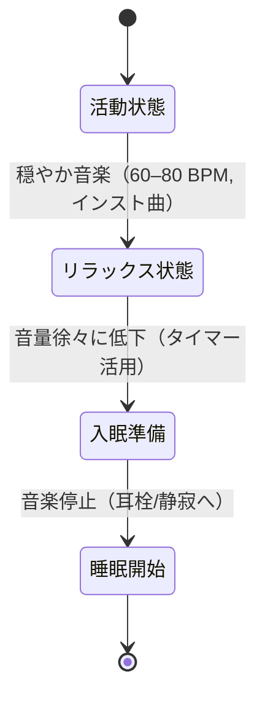

# エグゼクティブサマリー  
音楽・音響刺激は主観的な睡眠の質を改善する可能性が示唆されている一方、その効果は限定的・状況依存的である。成人不眠に関するCochraneレビューでは、1日25–50分のリラックス音楽聴取が睡眠の質（PSQI）を大幅に改善し（MD≈–2.8）、エビデンスは中程度と評価された。また、入眠潜時や総睡眠時間、睡眠効率にはわずかな改善傾向がみられたが信頼性は低かった。一方、急性ストレス下の健常者における音楽聴取のストレス緩和効果は総じて小さく、有意差は得られていない（効果量g≈0.15, CIはゼロ含む）。音楽は心拍変動(HRV)を高めて迷走神経活性を増強する傾向があり、リラックス効果の機序として期待されるが、研究方法の質は不十分である。白色/ピンクノイズを就眠中に流す事例は多いが、睡眠への効果は不明で、基礎研究ではピンクノイズ50dBでREM睡眠が約19分短縮されるなど逆効果の可能性が指摘されている。最終的な推奨として、入眠前の音楽聴取は60–80BPM程度の無歌詞・穏やかな音楽（環境音・ゆったりしたピアノ等）が適し、就寝後はタイマーで停止し、耳栓や静音環境で深睡眠に移行するのが望ましい。以下、主要研究の概要表と目的別推奨音響パラメータ一覧を示す。  

## 主要研究概要  

| 著者・年 (デザイン)                | 被験者数        | 介入パラメータ（タイプ/周波数等）                        | 主要アウトカム                                          | エビデンス評価 |
|:---------------------------------|:-------------:|:--------------------------------------------------|:-----------------------------------------------------|:------------:|
| **Jespersen 2022** (Cochrane SR) | RCT計13件計1007名 | 事前録音BGM聴取（クラシック等/60–85BPM程度、25–50分/日、3日～3か月） | PSQI: MD –2.79（95%CI –3.86～–1.72）の改善 Insomnia Severity: 有意差なし（very-low） SOL/TST/効率: わずかに改善傾向（low） | PSQI: 中 その他: 低 |
| **Li 2025** (メタ解析, 高齢者)       | RCT 6件+非RCT 4件、合計602名 | インストゥルメンタル・環境音楽等（60–85BPM中心, 20–60分/回, 1–7週） | 睡眠質（PSQI）: SMD –0.79（95%CI –1.25～–0.33）で改善（**very low** certainty） | 低 |
| **Adiasto 2022** (SR, 健常者)       | RCT 14件計706名    | 音楽聴取 vs 無音（ストレス課題後、手続き異）            | ストレス回復：総合効果量g≈0.15（95%CI –0.21～0.52、p=0.374）で無音と差なし | 低 |
| **Mojtabavi 2020** (SR, HRV)          | 研究29件計1368名   | 音楽介入（ジャンル多様、実験・パッシブ問わず）        | 心拍変動（HRV）: 大多数研究でparasympathetic指標（RMSSD等）上昇 | 低～中 (バイアス高) |
| **Riedy 2021** (SR, 雑音)             | 38研究（睡眠実験等）  | 白色/ピンクノイズ連続露出（デシベル・周波数不統一）    | 睡眠への効果: 研究間でばらつき大、エビデンス品質極めて低 | 低 |
| **Basner 2026** (睡眠実験)            | 25名（実験室）     | ピンクノイズ50dB vs 飛行機騒音 vs 耳栓                 | ピンクノイズ単独: REM睡眠が平均約19分減少。飛行機騒音で深睡眠約23分減少。耳栓で回復。ノイズ補聴機使用は注意喚起 | 低  |

*表注1: RCT=ランダム化比較試験、SR=系統的レビュー、PSQI=睡眠質質問票、SOL=入眠潜時、TST=総睡眠時間。エビデンス評価はGRADE基準（高/中/低）に基づく概算。表中未指定は情報不足。  

## 推奨設計パラメータ（目的別）  

- **リラックス用BGM**: テンポは60–80BPM程度、音色はやわらかく単純な旋律（例: ゆったりしたピアノ・環境音）を選ぶ。歌詞のないインストルメンタルが望ましく、音量は静かめ（40–50dB程度）に設定する。反復性や予測可能性が高いリズムが安定感を高めるとされる。  
- **就寝前（入眠促進）**: リラックス音楽を就寝前の15–60分間流す。音楽は緩やかな立ち上がりで徐々に穏やかになり、入眠時に向かって音量を下げることを推奨。タイマー設定で自動停止させる（目安30–45分）と、入眠後の睡眠中断リスクを減らせる。  
- **睡眠中**: 基本は静寂または環境音（例: 炎の音・雨音など）にし、就眠中の連続音は慎重に扱う。白色・ピンクノイズ機の連続使用はエビデンスが低く、逆にREMや深睡眠を減少させる可能性が指摘されている。周囲の突発音が気になる場合は、音楽よりむしろ耳栓着用が推奨される。間欠的な自然音（森や水音など）の利用はストレス軽減に有効との報告もあるが、就寝中の研究は不十分である。  

## 図：睡眠導入に向けた音楽聴取の状態遷移フロー  

*図中の遷移は、一般的な手順例。「リラックス状態」は交感神経活動の低下・副交感神経の亢進（α波増加など）を促し、「睡眠開始」期には音源を止めて持続的な覚醒刺激を排除する。エビデンスのない部分は灰色矢印で示す。

**推奨される因子・設定例（まとめ）**: リズム/速度はゆったり（60–80 BPM）、音色はソフトで単純な旋律、音量は最小限・静かめ（40–50dB以下）、歌詞や変拍子は避ける。就寝前は継続時間30–60分、睡眠中は耳栓や静寂を利用しノイズ曝露を最小化する。  

**エビデンスの限界と今後**: 音響介入の効果は個人差や環境に大きく依存し、多くの研究が小規模・主観評価のみである。PSG等客観測定を用いた大規模RCTが不足している。よって上記推奨は現時点の限られた証拠に基づく暫定的なものと位置づける。新たな研究では、介入細部（音源の具体的スペクトル・ビート周波数、個人選曲 vs 決め打ちなど）を詳述し、客観的睡眠指標（脳波・HRV等）と照合する必要がある。  

**参考文献**（原著・システマティックレビュー中心）: Cochraneレビュー、関連メタアナリシス、臨床試験および領域総説など。各研究のインターベンション詳細やエビデンス評価については本文表および引用元を参照のこと。